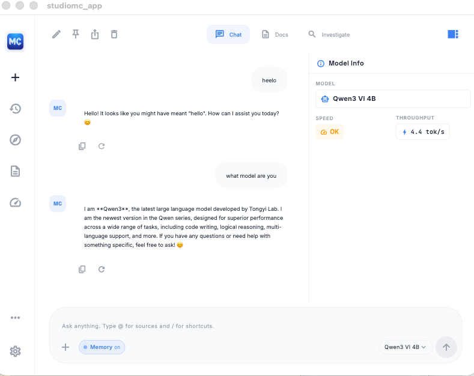

<p align="center">
  
</p>

<h1 align="center">Studiomc</h1>

<p align="center">
  <strong>Private AI that runs on your machine. No cloud. No account. No compromise.</strong>
</p>

<p align="center">
  <a href="https://github.com/mchawda/studiomc/releases/latest"></a>
  <a href="https://github.com/mchawda/studiomc/blob/main/LICENSE.md"></a>
  
  
</p>

<p align="center">
  
</p>

---

Studiomc is a desktop AI assistant that runs large language models entirely on your hardware. It auto-detects your system, recommends the best model, and gives you a ChatGPT-quality experience — fully offline, fully private.

## Why Studiomc

| Problem | Studiomc |
|---|---|
| Local AI tools feel like dev tools | Polished UI — install, click, chat |
| Users pick the wrong model and get frustrated | Hardware scan + automatic model recommendation |
| Document Q&A is slow and uncited | CLaRa compression-native retrieval with citations |
| No way to know if a model will run well | Speed ratings and performance predictions in plain English |
| Multiple backends, multiple interfaces | One unified interface across Ollama, LM Studio, and frontier APIs |

## Features

### Core
- **One-click install** — Working chat in under 2 minutes
- **Autopilot model selection** — Scans your hardware, picks the best model automatically
- **Multi-backend** — Auto-detects Ollama and LM Studio, connects frontier APIs (OpenAI, Anthropic)
- **Chat** — Streaming responses, conversation history, branching, memory
- **Local OpenAI-compatible API** — Integrate with any tool that speaks OpenAI
- **Privacy-first** — Everything runs locally. No telemetry. No accounts. No cloud unless you explicitly opt in.

### Document intelligence (RAG + CLaRa)
- **Docs mode** — Upload PDF/TXT/MD, ask questions, get **cited answers** grounded in your documents
- **CLaRa** — Compression-native retrieval: semantic embeddings (sentence-transformers or TF-IDF fallback), per-collection indexes, top-k retrieval with citations (p95 ≤150 ms)
- **RAG pipeline** — Extract → chunk (500–1000 tokens, overlap) → index → retrieve → generate with source citations

### Reasoning & orchestration
- **Recursive reasoning loop** — Plan → tool → observe → answer; supports cited (CLaRa), fast, and investigate modes
- **LRE (Local Reasoning Environment)** — Safe tool layer for the loop: search, grep, open, summarize, table_extract, cite; sandboxed with call budgets
- **Investigate mode** — Full reasoning trace visibility: tool calls, retrieved chunks, and final answer in one view

### Inference
- **SpliceLLM** — Our built-in out-of-core engine: run models of any size by **streaming layers from disk** one at a time. Model splitter turns HuggingFace checkpoints into per-layer safetensors; only one layer in memory at a time. Prefetch overlaps I/O with compute. Enables large models on limited VRAM/RAM (e.g. 70B on 4GB with clear “slow mode” expectations)
- **Multi-backend inference** — Bundled engine, Ollama, LM Studio, or frontier APIs; router picks the right backend per model
- **Performance dashboard** — Speed rating (Fast/OK/Slow), throughput, system metrics

## Quick Start

**No prerequisites. No Ollama. No Python. Just install and chat.**

### Install from Release

1. Download the latest `.dmg` from [Releases](https://github.com/mchawda/studiomc/releases/latest)
2. Open the DMG and drag **Studiomc** to Applications
3. Launch Studiomc — it scans your hardware and recommends a model
4. The model downloads from HuggingFace automatically
5. You're chatting in under 2 minutes

> **Note:** The app is currently unsigned. On first launch, right-click the app and select "Open" to bypass macOS Gatekeeper.

### Optional: Ollama / LM Studio

If you already have [Ollama](https://ollama.com) or [LM Studio](https://lmstudio.ai) installed, Studiomc auto-detects them and adds their models to your model list. No configuration needed.

### Build from Source

```bash
# Clone
git clone https://github.com/mchawda/studiomc.git
cd studiomc

# Build macOS app + DMG
./scripts/build-macos.sh

# Output: dist/Studiomc-<version>-macos.dmg
```

Requires: [Flutter SDK](https://docs.flutter.dev/get-started/install) (stable channel)

## Architecture

```
Flutter App ── HTTP/WS ──▶ Local Supervisor
                              ├── Inference Router
                              │     ├── Ollama (auto-detected)
                              │     ├── LM Studio (auto-detected)
                              │     ├── SpliceLLM (built-in, out-of-core)
                              │     └── Frontier APIs (optional)
                              ├── Model Manager
                              ├── Document Service (extract, chunk, store)
                              ├── CLaRa (compression-native retrieval + cited answer)
                              ├── Orchestrator (recursive reasoning loop: plan → tool → answer)
                              └── LRE (Local Reasoning Environment — tools for the loop)
```

- **Frontend:** Flutter (Dart) — macOS, Windows, iOS, Android
- **Inference:** SpliceLLM (layer streaming from disk), optional Ollama / LM Studio / frontier API
- **Models:** HuggingFace GGUF or safetensors; splitter produces per-layer files for out-of-core
- **Backend:** Python FastAPI — documents, CLaRa RAG, orchestrator, LRE
- **Storage:** SQLite + filesystem

## Project Structure

```
studiomc/
  studiomc_app/           # Flutter app
    lib/
      screens/            # Chat, Models, Documents, Settings, Training, etc.
      widgets/            # Reusable UI components
      services/           # API clients, inference, orchestrator, settings
      models/             # Data models
  services/               # Python backend
    supervisor/           # Process manager
    inference/            # Out-of-core engine, splitter, router (Ollama/LM Studio/frontier)
    model_manager/       # Model downloads, registry, autopilot
    documents/           # Document extraction, chunking, storage
    clara/                # CLaRa — compression-native retrieval + cited answer
    lre/                  # LRE — tools for orchestrator (search, grep, summarize, etc.)
    orchestrator/         # Recursive reasoning loop (plan → tool → observe → answer)
    training/             # Private training / personalization
  scripts/                # Build & release tooling
  product/                # Product specs & design docs
```

## Development Status

The project follows four release phases. **Phase 1** (core chat, models, docs, CLaRa, SpliceLLM) is mostly complete. **Phases 2–4** (orchestrator/LRE, Personalize wizard, investigate mode) are in progress. See `product/product-roadmap.md` for details.

## Performance Targets

| Metric | Target |
|---|---|
| Install to first chat | ≤ 2 min |
| First token latency | ≤ 2.5s (recommended models) |
| Throughput | ≥ 10 tok/s GPU, ≥ 4 tok/s CPU |
| Document retrieval | p95 ≤ 150ms |

## Contributing

Contributions welcome. Please open an issue first to discuss what you'd like to change.

## Credits

Built on the shoulders of:
- [AirLLM](https://github.com/lyogavin/airllm) — Inspired SpliceLLM’s out-of-core (layer-streaming) approach
- [Ollama](https://ollama.com) — Local model runtime
- [Flutter](https://flutter.dev) — Cross-platform UI

## License

Source-available — free to use, not open-source. See [LICENSE.md](LICENSE.md) for full terms and `THIRD_PARTY_NOTICES.md` for open-source attribution. Copyright 2024-2026 NIA Pte Ltd.
